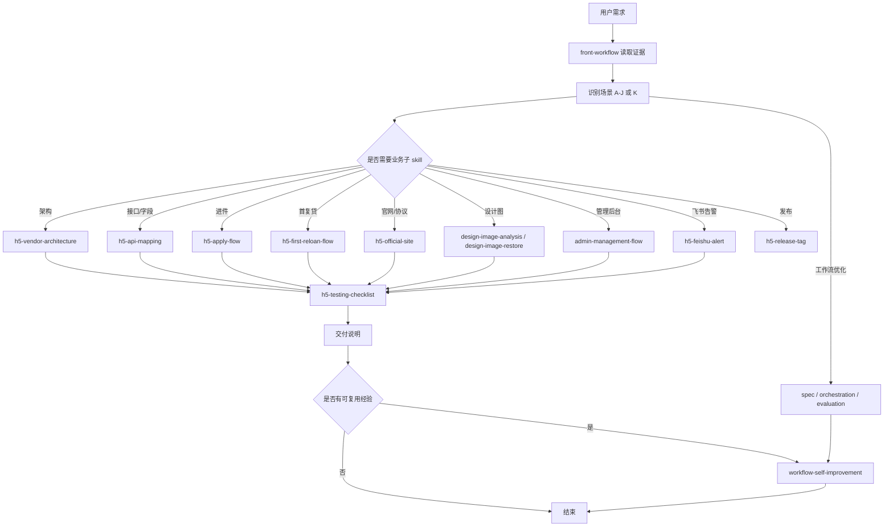

# 前端工作流实现逻辑分享

## 1. 背景：为什么需要前端工作流

前端需求看起来常常只是“改一个页面”或“接一个接口”，但真正执行时会牵出很多隐性判断：

- 这是普通功能开发，还是进件、首复贷、管理后台、官网协议、发布或监控？
- 接口文档只是字段输入，还是会改变业务流程？
- 设计图只是视觉参考，还是要完整复原页面并处理切图？
- 交付前应该跑哪些检查，哪些必须留给真实 WebView 或人工验收？
- 本次踩到的规则，是否应该沉淀到工作流里，避免下次重复判断？

`front-workflow` 的核心价值，就是把这些判断从“靠经验临场发挥”变成一套可复用的调度流程。它不是某个具体业务的实现文件，而是一个需求决策器：先读取证据，再判断场景，然后调度对应的子 skill 执行，最后统一验收和沉淀经验。

## 2. 总体架构：主工作流 + 子 skill + 验收 + 自我更新

这套工作流采用“主编排 + 子模块执行”的结构：

- `front-workflow`：主工作流，只负责识别需求、判断场景、安排执行链和交付出口。
- 业务子 skill：负责具体执行，例如接口映射、进件、首复贷、官网、后台、设计图复原、发布等。
- `h5-testing-checklist`：统一负责交付前验收、专项检查、checkpoint 和交付说明。
- `workflow-self-improvement`：负责把可复用经验沉淀回主工作流或对应子 skill。
- 元能力 skill：在复杂、模糊或工作流巡检场景中，用 `spec-driven-development`、`workflow-orchestration-patterns`、`llm-evaluation` 辅助规格化、编排审查和回归评估。

这个架构的关键点是职责分离：主工作流不写大段业务细节，子 skill 不抢主流程的调度职责，验收模块不参与业务实现，自我更新模块不直接做业务开发。

## 3. 核心执行链

### 3.1 读取需求和项目证据

工作流第一步不是直接按触发词行动，而是先看证据：

- 用户输入和最新上下文
- 当前目录和项目结构
- 路由、页面、接口封装、配置文件
- `design/`、`release-env`、接口文档、协议文档等材料
- `.workflow-checkpoint.json` 或 automation memory

这么做是为了避免“词命中了，但项目证据不支持”的误判。例如用户说“配置页”，如果项目是 Vue/Element UI 后台，并且存在 `src/views`、`src/api`、权限或菜单结构，那么它更可能归到管理后台场景，而不是普通 H5 页面。

### 3.2 识别场景

`front-workflow` 把常见需求拆成 A-J 十类，再用 K 兜底未知或复合需求：

| 场景 | 归属 | 典型意图 | 主要执行链 |
| --- | --- | --- | --- |
| A | 架构改造 | depend、vendor、static-app、本地资源、Vite external | `h5-vendor-architecture` -> `h5-testing-checklist` |
| B | 功能/API 开发 | 普通功能、新接口、字段适配 | 可选 `h5-api-mapping` -> `h5-testing-checklist` |
| C | 首复贷开发 | 首贷、复贷、状态流、订单、还款、额度确认 | 可选 `h5-api-mapping` -> `h5-first-reloan-flow` -> `h5-testing-checklist` |
| D | 进件开发 | Apply、Entry、步骤页、原生交互、国家差异 | 可选 `h5-api-mapping` -> `h5-apply-flow` -> `h5-testing-checklist` |
| E | 官网/协议/挂载 H5 | 官网、协议 HTML、App 内嵌协议、客服问答 | `h5-official-site` -> `h5-testing-checklist` |
| F | 设计图复原 | design 图片解析、照图实现、切图命名 | `design-image-analysis` -> `design-image-restore` -> `h5-testing-checklist` |
| G | 国家发布 | 发布、发版、打 tag、mx/co/ng | `h5-release-tag` |
| H | 工作流自我更新 | 记住规则、完善 skill、巡检流程 | `spec-driven-development` -> `workflow-self-improvement` |
| I | 管理后台开发 | 后台管理、Element UI、角色权限、模型配置 | `admin-management-flow` -> `h5-testing-checklist` |
| J | 飞书前端告警 | 白屏监控、异常告警、Promise 异常 | `h5-feishu-alert` -> `h5-testing-checklist` |
| K | 未知/复合需求分析 | 不能稳定命中 A-J，或多个场景交织 | 先探索候选归属 -> 回落到最接近的子 skill -> `h5-testing-checklist` |

这里的重点不是背场景表，而是学习分类方法：先按业务责任边界拆，再按执行差异拆，最后为无法稳定分类的需求保留兜底路径。

### 3.3 生成执行链

场景确认后，主工作流会生成执行链：

- 必调子 skill：本次必须执行的业务模块。
- 可选子 skill：只有满足条件才调用，例如新接口文档才需要 `h5-api-mapping`。
- 跳过子 skill：明确记录为什么不调用，避免后续复盘时不知道判断依据。

复合需求会先确定主目标，再把其他能力作为辅助输入。例如“根据设计图改后台配置页并接接口”，主目标是管理后台开发，设计图是视觉输入，接口文档是字段输入，所以执行思路是：

1. 用设计图解析和复原能力辅助视觉还原。
2. 用接口映射能力理解字段和路径。
3. 主实现仍归 `admin-management-flow`。
4. 最后用 `h5-testing-checklist` 做后台专项验收。

### 3.4 只询问阻塞信息

这套工作流强调“先查再问”。凡是可以从项目中推断的信息，都应该先从代码、配置和材料里找，而不是直接问用户。

只有这些情况才需要问：

- 缺少项目路径，无法开始探索。
- 找不到目标页面或模块，且存在多个候选。
- 业务目标本身含糊，无法判断要改什么。
- 涉及发布、资金、风控、权限、真实用户状态流等高风险结论，无法从现有证据确认。

这能显著减少无效沟通，也能让工作流更适合自动化续跑。

### 3.5 交付和沉淀

业务执行完成后，不是简单说“改完了”，而是进入统一交付出口：

- `h5-testing-checklist` 负责选择验收等级：`focused`、`full`、`release`。
- 每个场景有自己的专项检查，例如首复贷、进件、后台、飞书告警、官网协议等。
- 真实 WebView、键盘遮挡、原生桥接等无法纯靠桌面验证的内容，要明确列为人工待验。
- 本次发现的可复用规则，会交给 `workflow-self-improvement` 判断归属并沉淀。

沉淀的优先级是：先补判断标准，再补执行顺序，最后才补具体限制。这样工作流会越来越像一个稳定系统，而不是越写越散的备忘录。

## 4. 实现思路：为什么要这样设计

### 4.1 场景设计：把需求从“自然语言”变成“可执行路径”

场景设计是这套工作流的第一层抽象。它解决的问题是：用户的表达往往是模糊的，但执行必须是确定的。

例如“改配置页”“接接口”“还原页面”这些话，如果只按关键词判断，很容易走错方向。配置页可能是 H5 页面，也可能是管理后台；接接口可能只是普通字段适配，也可能会影响首复贷状态流；还原页面可能只是视觉工作，也可能要进入进件或后台业务流程。

所以 `front-workflow` 不按页面名称拆场景，而是按三个维度拆：

| 维度 | 判断问题 | 作用 |
| --- | --- | --- |
| 业务责任 | 这类需求属于哪个业务域？ | 区分进件、首复贷、后台、官网、发布、监控等 |
| 执行差异 | 它需要哪些不同执行动作？ | 决定调用哪个子 skill，哪些能力只是辅助 |
| 验收风险 | 它会带来哪些交付风险？ | 决定专项检查、人工待验和高风险确认 |

A-J 是稳定场景，K 是未知或复合需求兜底。这里保留 K 很重要，因为真实项目一定会出现新需求。如果没有兜底场景，工作流要么卡住，要么硬套到错误场景；有了 K，就可以先探索证据、列候选归属、选择最接近的现有能力执行，并在任务结束后沉淀新的判断标准。

场景设计背后的原则是：让 AI 先做“归类和调度”，再做“执行”。这样每次需求都能落到一条可解释、可复盘、可验收的路径上。

### 4.2 工作断点和上下文折叠处理：让长任务可恢复

前端任务经常不是一次对话就能完成的：可能中途被用户打断，可能要等待接口或设计确认，可能是自动化巡检续跑，也可能因为上下文变长而被折叠。只依赖对话历史会有两个问题：

- 上下文折叠后，执行者可能忘记已经查过什么、完成到哪一步。
- 重新开始会重复探索、重复判断，甚至覆盖之前已经确认的结论。

所以工作流引入 `.workflow-checkpoint.json` 作为断点状态。它不是简单记录“当前第几步”，而是记录完整执行轨迹和决策上下文：

| 字段 | 作用 |
| --- | --- |
| `scene` | 当前任务归属的场景 A-J/K |
| `completed_steps` | 追加式记录每个已完成步骤，保留完整轨迹 |
| `last_completed_step` | 快速恢复索引，但不能替代完整历史 |
| `step_names` | 保留每个步骤的名称，方便恢复时读懂进度 |
| `context.discovered_facts` | 已经从代码、配置、文档中确认的事实 |
| `context.assumptions` | 不阻塞执行的默认判断及风险 |
| `context.scene_confidence` | 场景判断置信度 |
| `context.selected_scene_reason` | 为什么选择当前场景 |
| `context.skipped_skills` | 哪些可选子 skill 被跳过，以及原因 |

这种设计本质上是在把“工作记忆”从对话里抽出来，放到项目可读的状态文件中。即使对话被折叠，恢复时也能知道：

1. 已经完成了哪些步骤。
2. 哪些事实是代码证据确认过的。
3. 哪些默认值只是临时假设。
4. 哪些子 skill 被跳过，为什么跳过。
5. 下一步应该从哪里继续。

断点处理还区分普通任务和自动化续跑：普通一次性任务交付完成后可以清理 checkpoint；场景 H、recurring automation、automation memory 续跑、运行时漂移或外部阻塞未解决时要保留 checkpoint，避免下一轮重复处理已确认的问题。

为什么要做这层机制？因为工作流一旦从“短问答”变成“长期协作”，可靠性就不只取决于回答质量，还取决于能不能恢复现场、保留判断依据、避免重复劳动。

### 4.3 自我沉淀实现：让工作流从项目经验里进化

自我沉淀解决的是另一个长期问题：项目经验如果只停留在一次交付里，下次还会重新踩同样的坑。

`workflow-self-improvement` 把沉淀过程做成一个闭环：

1. 发现：识别重复人工修正、遗漏验收、新国家差异、新接口模式、未知需求兜底判断等可复用经验。
2. 归属：判断这条经验应该写入主工作流、业务子 skill、验收模块，还是只作为项目特例保留。
3. 修改：只更新对应位置，不把所有细节都塞回主工作流。
4. 校验：检查 diff，运行 skill 校验，必要时做工作流回归评估。
5. 交付：说明沉淀了什么、写到哪里、校验结果是什么。

沉淀时最重要的是“归属判断”：

| 经验类型 | 应写位置 | 原因 |
| --- | --- | --- |
| 场景识别、调度顺序、K 兜底标准 | `front-workflow` | 影响的是主流程如何判断和编排 |
| 业务执行细节 | 对应业务子 skill | 避免主工作流膨胀 |
| 验收缺口、人工待验项 | `h5-testing-checklist` | 影响的是交付质量控制 |
| 接口字段映射模式 | `h5-api-mapping` | 属于接口解析和迁移方法 |
| 单项目事实 | 默认不沉淀 | 避免把一次性情况写成通用规则 |

为什么要有自我沉淀？因为前端业务变化快，今天遇到的新国家、新接口模式、新后台权限规则，明天可能就会重复出现。如果每次都靠人提醒，工作流不会变强；如果不加归属控制地乱记，又会把流程写乱。自我沉淀的价值，就是在“能学习”和“不乱学”之间建立边界。

## 5. 关键设计原则

### 5.1 证据优先，触发词只是辅助

触发词可以帮助快速形成候选场景，但不能替代项目证据。真正的判断要结合项目结构、路由、接口、配置、设计图、发布文件和 checkpoint。

这条原则适合所有团队复用：不要让工作流只靠关键词路由，否则稍微换个说法就会误判。

### 5.2 主流程只编排，不承载细节

`front-workflow` 只保存“如何判断”和“如何调度”，不维护大段业务实现细节。业务细节放到对应子 skill，例如：

- 进件流程和国家差异归 `h5-apply-flow`。
- 首复贷状态流归 `h5-first-reloan-flow`。
- 后台功能归 `admin-management-flow`。
- 发布规则归 `h5-release-tag`。
- 验收清单归 `h5-testing-checklist`。

这样可以避免主工作流膨胀，也方便不同同事维护自己熟悉的业务模块。

### 5.3 少问用户，但不盲目猜高风险结论

工作流会尽量从代码中推断默认值，并把假设记录到 checkpoint 或交付说明里。但如果结论会影响发布、资金、风控、权限或真实用户状态流，就必须让用户确认。

好的自动化不是完全不问，而是只问当前真正阻塞的问题。

### 5.4 验收是公共出口，不散落在业务里

不同业务模块可以有自己的专项检查，但交付口统一归 `h5-testing-checklist`。这样有几个好处：

- 每次交付都有一致的验收语言。
- 可以按风险选择 `focused`、`full`、`release`。
- 业务专项不会漏掉公共检查。
- 无法自动验证的内容会被显式标记，而不是假装通过。

### 5.5 经验沉淀要判断归属

不是所有经验都应该写进主工作流。`workflow-self-improvement` 会先判断经验类型：

| 经验类型 | 默认归属 |
| --- | --- |
| 场景识别、调度顺序、未知需求兜底 | `front-workflow` |
| 验收缺口、人工待验项 | `h5-testing-checklist` |
| 接口字段映射模式 | `h5-api-mapping` |
| 具体业务流程规则 | 对应业务子 skill |
| 一次性项目事实 | 默认不沉淀，除非确认跨项目通用 |

这条原则很重要：沉淀的目标不是“把所有东西记住”，而是把可复用、归属清晰、能减少未来判断成本的规则固化下来。

## 6. 典型案例

### 6.1 设计图复原

用户说：“根据 design 文件夹图片还原页面。”

工作流判断：

- 明确命中设计图复原场景 F。
- 先用 `design-image-analysis` 按 375px 宽基准拆解布局、间距、颜色、文字和切图需求。
- 再用 `design-image-restore` 在项目中复原页面，并优先复用已有 assets/public 资源。
- 最后用 `h5-testing-checklist` 做页面、构建和视觉相关验收。

可复用思路：视觉输入不要直接抢占业务主流程。如果设计图是后台页、进件页或首复贷页，还要回到对应业务场景执行。

### 6.2 首复贷开发

用户说：“调整复贷订单状态和还款页。”

工作流判断：

- 命中首复贷场景 C。
- 如果有新接口文档或字段替换，先调用 `h5-api-mapping`。
- 业务实现归 `h5-first-reloan-flow`，重点关注状态流、订单详情、未确认、放款、还款、App 列表等。
- 如果用户明确要求异常监控，再串联 `h5-feishu-alert`。
- 交付前用 `h5-testing-checklist` 做首复贷专项验收。

可复用思路：状态流类需求不要归到普通功能开发，因为它通常涉及入口分发、数据源、原生回调和真实用户状态。

### 6.3 管理后台开发

用户说：“后台模型配置页新增一个列表入口并接接口。”

工作流判断：

- 命中管理后台场景 I。
- 实现归 `admin-management-flow`，关注 Vue/Element UI、路由、菜单、权限、列表/详情/配置页、i18n 和接口错误态。
- 如果有新接口文档，可以参考 `h5-api-mapping` 的字段映射方法，但主实现仍属于后台流程。
- 最后用 `h5-testing-checklist` 做后台专项验收。

可复用思路：同样是“接接口”，不同项目类型的验收重点完全不同。场景判断要优先看项目结构。

### 6.4 未知或复合需求

用户说：“帮我把这个新 H5 工具完善一下。”

工作流判断：

- 不能稳定命中 A-J，进入 K。
- 先搜索项目结构，确认技术栈、路由、页面入口、接口组织和可运行脚本。
- 列出 1-3 个候选归属，并给出证据和置信度。
- 选择风险最低、最接近的现有子 skill 执行。
- 如果最终形成可复用判断标准，交给 `workflow-self-improvement` 沉淀。

可复用思路：未知场景不能直接卡住，也不能无限追问。先探索，再候选归属，再回落到现有能力。

### 6.5 工作流自我更新

用户说：“下次遇到这种情况按这个规则来。”

工作流判断：

- 命中工作流自我更新场景 H。
- 如果只是单条明确规则，可以轻量记录目标后直接沉淀。
- 如果是巡检、优化或较大改造，先用 `spec-driven-development` 固化目标和成功标准。
- 再用 `workflow-self-improvement` 判断规则归属，修改对应 skill。
- 必要时用 `workflow-orchestration-patterns` 检查编排边界，用 `llm-evaluation` 做回归样例评估。

可复用思路：工作流要能从实际任务中学习，但学习要有边界，避免把一次性项目事实写成全局规则。

## 7. 如何复用这套设计方法

如果要为自己的团队搭一套类似工作流，可以按下面步骤拆：

1. 找出主流程

先定义一个主工作流，只负责回答三个问题：

- 这是什么类型的需求？
- 应该调哪些执行模块？
- 交付前要经过什么出口？

主流程不要写太多具体实现，否则后期会难维护。

2. 拆出业务子模块

按“执行方式真的不同”来拆模块，而不是按页面名称随意拆。例如：

- 页面开发和发布应该分开。
- 接口字段映射和业务状态流应该分开。
- 设计图解析和业务实现应该分开。
- 后台和 H5 应该分开。

判断标准是：如果两类需求的证据、执行链、验收重点都不同，就值得拆成不同模块。

3. 建立场景表

为每个场景定义：

- 触发意图
- 项目证据
- 必调模块
- 可选模块
- 验收重点
- 需要问用户的高风险点

场景表不只是给 AI 看，也能帮团队对齐需求归类方式。

4. 设计兜底路径

一定要有未知或复合需求兜底。兜底流程建议固定为：

- 先探索项目证据。
- 列候选归属和置信度。
- 选择最接近的现有模块执行。
- 任务结束后判断是否要沉淀新规则。

这能避免工作流遇到新需求就失效。

5. 统一验收出口

把验收从各业务模块里抽出来，形成公共出口。至少区分：

- 小改验收
- 默认业务验收
- 发布验收
- 专项验收
- 人工待验项

交付质量稳定以后，工作流才真正能被团队放心复用。

6. 让工作流能自我更新

每次任务结束后问三个问题：

- 这次是否出现了重复判断？
- 是否发现了现有验收没覆盖的风险？
- 是否有新规则能跨项目复用？

如果答案是肯定的，就把经验沉淀到正确位置。长期看，工作流的质量主要来自这种小步更新。

## 8. 分享时可以强调的几个观点

- 工作流不是“提示词大全”，而是一套需求决策系统。
- 场景设计的目的，是把模糊需求转换成可执行、可验收、可复盘的路径。
- 触发词只能辅助判断，真正可靠的是项目证据。
- 主流程要像调度器，子模块要像专职执行者。
- checkpoint 不是进度条，而是处理上下文折叠和中断恢复的工作记忆。
- 少问用户不是盲猜，而是先查证据，只问阻塞项。
- 验收要统一出口，否则每个模块都会形成自己的交付口径。
- 自我更新要沉淀判断标准，而不是堆一次性规则；要能学习，也要知道什么不能学。

## 9. 参考文件

- `front-workflow/SKILL.md`：主工作流的完整调度规则。
- `front-workflow/README.md`：主工作流的简要说明和子 skill 列表。
- `h5-testing-checklist/SKILL.md`：公共验收、checkpoint 和交付规则。
- `workflow-self-improvement/SKILL.md`：经验沉淀、工作流巡检和自我更新规则。
